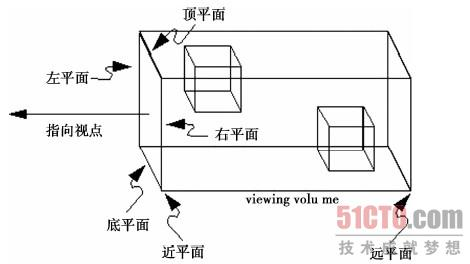
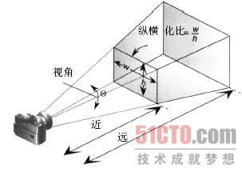

# threejs-demo
## 相机
THREE.Camera是相机的抽象基类，子类有两种，分别是正投影相机`THREE.OrthographicCamera`和透视投影相机`THREE.PerspectiveCamera`
### 正投影相机
> OrthographicCamera( left, right, top, bottom, near, far )  
> 分别对应6个面(上下左右前后)

### 透视投影相机(远小近大)
> PerspectiveCamera(fov, aspect, near, far)

1. fov 视角，透视投影的角度
2. near 近平面距离
3. far 远平面距离
4. 图中w和h的比例，视线平面的纵横比

## 光源
### 光源基类
> Light(hex)
1. hex接受一个16进制的颜色值
### 环境光
> AmbientLight(hex)
### 点光源
> PointLight(color, intensity, distance)
1. color 光的颜色
2. intensity 光的强度， 默认1.0，即最强光
3. distance 光的距离，从光源所在位置经过distance距离，光的强度衰减为0，默认为0，即不衰减
### 聚光灯
> SpotLight( hex, intensity, distance, angle, exponent )
1. hex 光颜色
2. intensity
3. distance
4. angle 聚光灯着色的角度，一弧度为单位
5. exponent 光衰减的参数，越大衰减越快
### 方向光
> DirectionalLight(hex, intensity)
